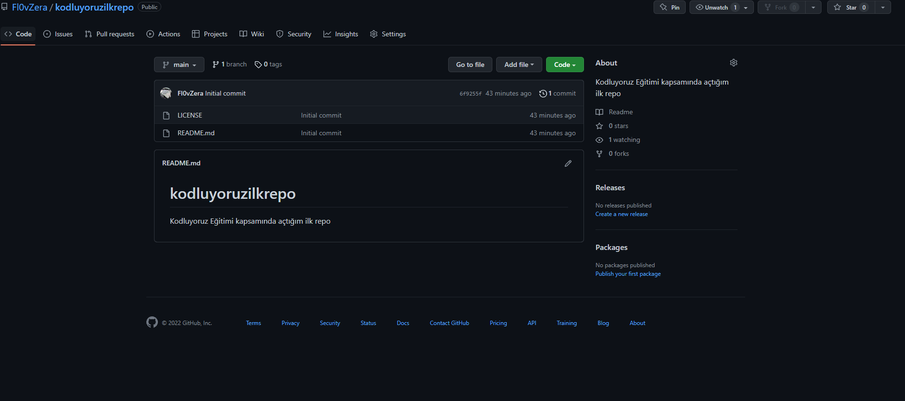

# Kodluyoruz ilk repo

Bu repo [Kodluyoruz](https://kodluyoruz.org/tr/kodluyoruz/) Front-End Egitiminde olusturdugumuz ilk repo. Icerisinde bir adet README dosyasi, bir adet de index.html barindiriyor.

## Installation

Oncelikle projeyi clonelayin
https://github.com/Fl0vZera/kodluyoruzilkrepo.git
#Usage
Projeyi cloneladiktan sonra Visual studio Code programini acin
Linux Icin:
cd kodluyoruzilkrepo
code

## Contributing

Pull requestler kabul edilir. Büyük değişiklikler için, lütfen önce neyi değiştirmek istediğinizi tartışmak için bir konu açınız

## License

[MIT](https://choosealicense.com/licenses/mit/)
